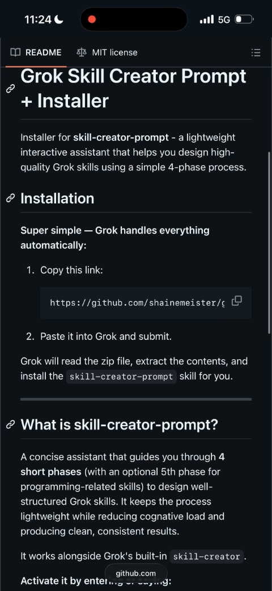

# Grok Skill Creator Prompt + Installer

Installer for **skill-creator-prompt** - a lightweight interactive assistant that helps you design high-quality Grok skills using a simple 4-phase process.

**⚠️ Important Security Recommendation**  
Before pasting any installation link or file, **always ask Grok to review the contents first**. This helps verify there are no malicious or unintended instructions that could instruct Grok to phone home to external links, write context to an API, or perform other actions without your knowledge or consent.  

Skills and installers should never contain behavior involving potential exploitation or actions against a user's will. Reviewing for safety and transparency is strongly recommended as a best practice.

Before using any installation link or zip file with Grok, **first ask Grok to review it** for safety and malicious instructions.

**Copy & paste this example:**
```
Review this installation file first, evaluate for security or malicious code: https://github.com/shainemeister/grok-skill-creator-prompt-installer/blob/main/skill-creator-prompt-installer.zip
```

## Installation

**Super simple — Grok handles everything automatically:**

1. Copy this link:
   ```
   https://github.com/shainemeister/grok-skill-creator-prompt-installer/blob/main/skill-creator-prompt-installer.zip
   ```

2. Paste it into Grok and submit.

Grok will read the zip file, extract the contents, and install the `skill-creator-prompt` skill for you.



---

## What is skill-creator-prompt?

A concise assistant that guides you through **4 short phases** (with an optional 5th phase for programming-related skills) to design well-structured Grok skills. It keeps the process lightweight while reducing cognative load and producing clean, consistent results.

It works alongside Grok's built-in `skill-creator`.

**Activate it by entering or saying:**
- `/skill-creator-prompt`
- “Use skill-creator-prompt to create a skill”

---

## Folder Structure

```
grok-skill-creator-prompt-installer/
├── README.md
├── LICENSE
├── skill-creator-prompt-installer.zip
└── skill-creator-prompt-source/
    ├── SKILL.md
    └── references/
```

---

## Notes

- Designed to be short, clear, and low-friction.
- This package is ready to be zipped and shared.

**License:** MIT — see [LICENSE](LICENSE)
